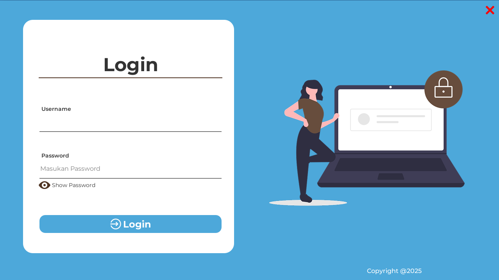
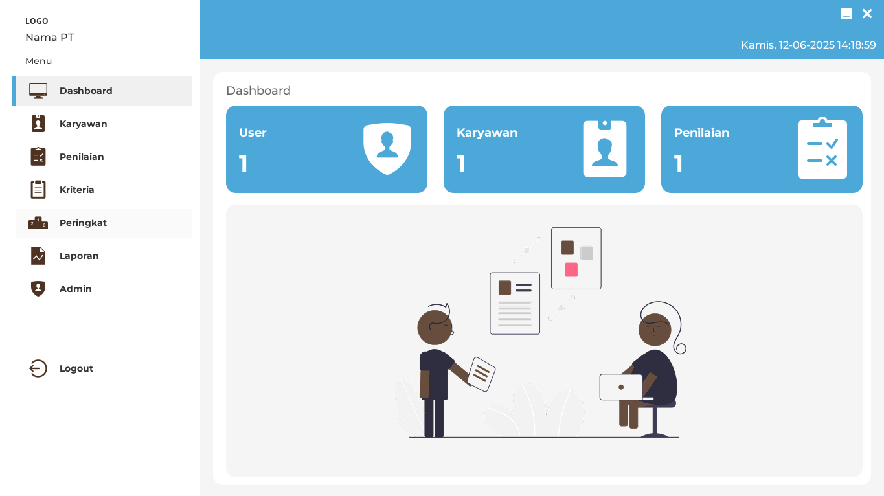
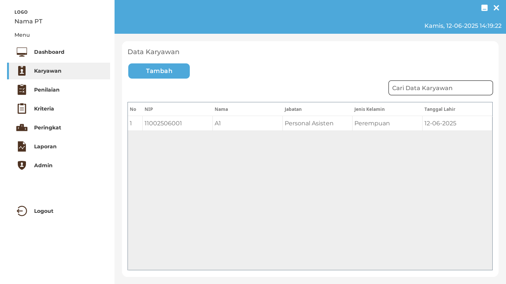
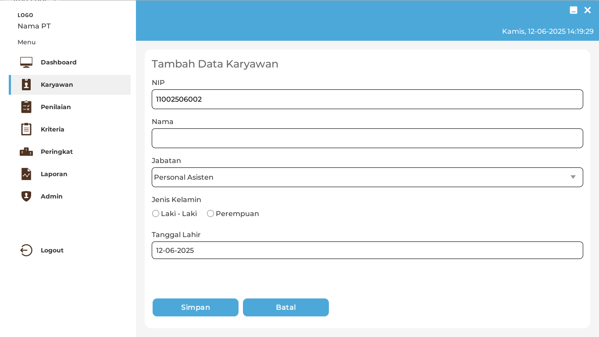
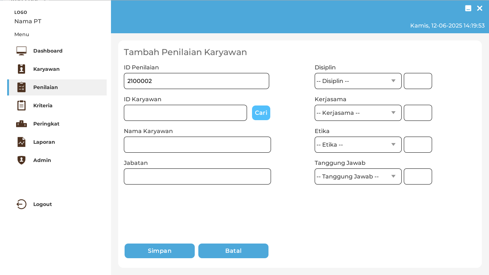
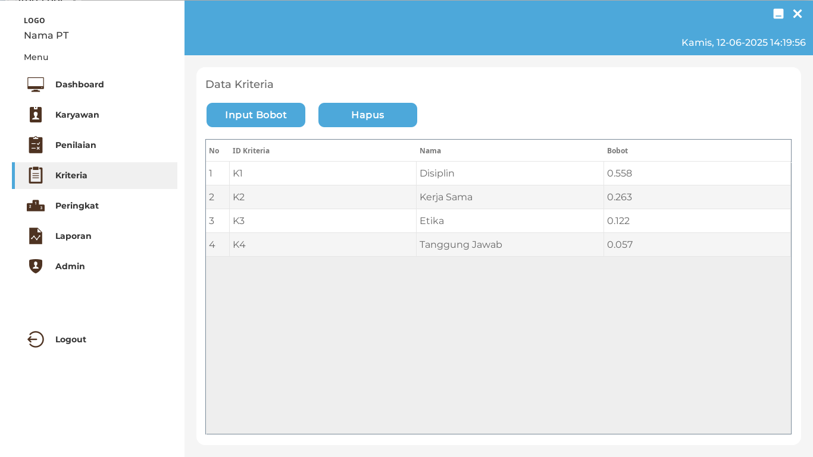
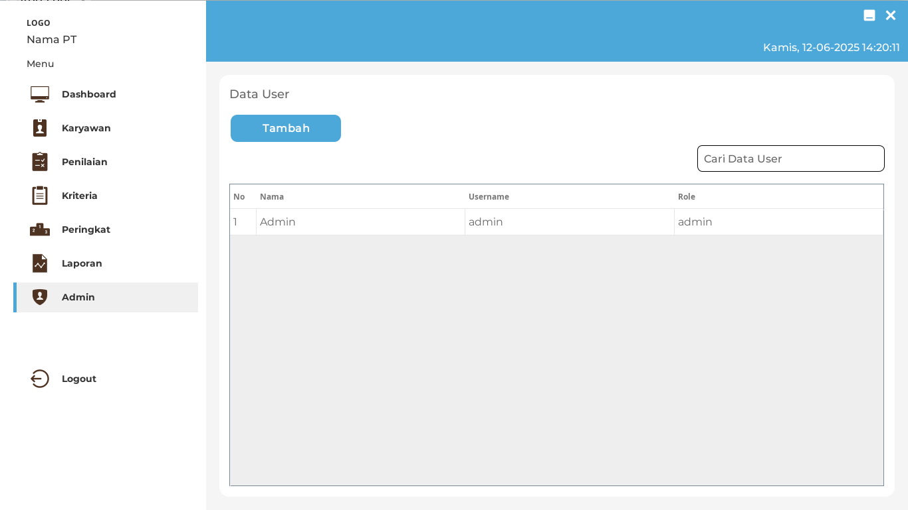
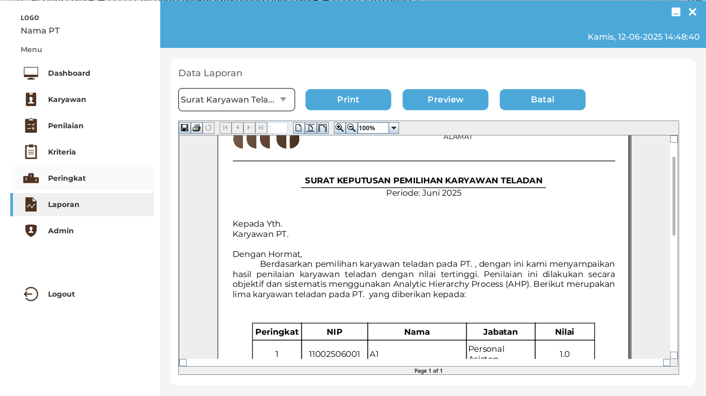

# Aplikasi Penentuan Karyawan Teladan Dengan Metode AHP

Membangun Aplikasi Dekstop Sistem Pendukung Keputusan menggunakan Java Netbeans

## Teknologi 

Website ini dikembangkan menggunakan teknologi berikut:

- Java dan MySql.

## Author 

- [Yabsir Aditya](https://www.instagram.com/yabsir.y/)

## Spesifikasi Software yang digunankan
- Netbeans IDE 21
- JDK Java 21
- Apache dan MysQL
- IReport 5.5.0 (JasperReport Lib Netbeans IDE)

## Screenshot Aplikasi

  
Login

  

  
Dashboard

  

  
Menu Karyawan

  
  

  
Menu Penilaian Karyawan

  
  

  
Menu Bobot Kriteria

  

  
Menu Peringkat Karyawan

  

  
Menu Admin

  

  
Menu Laporan

  

